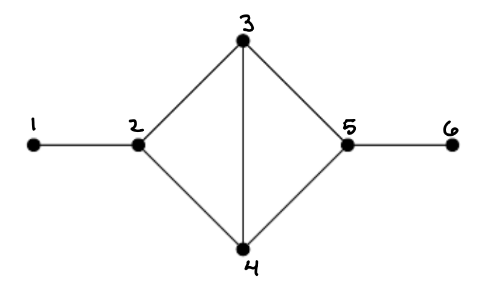

### Directions
Solve the following problems and type up your solutions.  Your solutions should be provided in one of the following formats (in order of preference)
* typed up in $$\LaTeX$$ and submitted as a PDF on Canvas
* written legibly on blank paper, scanned into a PDF and then uploaded on Canvas
* inscribed in animal bone and pitched into a Scottish bog to be preserved for future generations

If you go with the first strategy, you may wish to check out Overleaf which is a free and intuitive website for generating $$\LaTeX$$ documents online.
If you wish to use the second method and don't own a scanner at home, you can check out the numerous scanning apps available for smartphones.

**Problem 1:** Write each of the following elements of $$S_9$$ in cycle notation

* (A)
$$\left(\begin{array}{ccccccccc}
1 & 2 & 3 & 4 & 5 & 6 & 7 & 8 & 9\\
3 & 4 & 5 & 6 & 7 & 8 & 9 & 2 & 1
\end{array}\right)$$

* (B)
$$\left(\begin{array}{ccccccccc}
1 & 2 & 3 & 4 & 5 & 6 & 7 & 8 & 9\\
9 & 2 & 3 & 5 & 4 & 7 & 6 & 8 & 1
\end{array}\right)$$

**Problem 2:** Determine the value of each of the following complex numbers in $$a+ib$$ form

* (A) (8 + 2i)(3-i)
* (B) (1 + i)^{16}

**Problem 3:** Let $$n\geq 1$$ and let $$U_n$$ be the set of $$n$$'th roots of unity

$$U_n = \{z\in \mathbb C: z^n=1\}.$$

* (A) Prove that $$U_n$$ is a group with binary operation given by complex multiplication.
* (B) Show that the function

$$f: \mathbb{Z}_n\rightarrow\mathbb{U}_n,\ \ f(k) = \exp\left(2\pi i\frac{k}{n}\right)$$

is a group isomorphism from $$\mathbb{Z}_n$$ to $$U_n$$.

**Problem 4:**

Recall that an (undirected) **graph** $$G=(V,E)$$ is a set $$V$$ of **vertices**, along with a symmetric subset $$E\subseteq V\times V$$ of **edges** which connect the vertices.  Here symmetric means $$(v_1,v_2)\in E$$ implies $$(v_2,v_1)\in E$$.

Pictorially, we can represent a graph as a collection of black circles representing the vertices, connected in between by lines representing the edges. For example.

An **automorphism** of the graph $$G=(V,E)$$ is a bijection $$f: V\rightarrow V$$ satisfying $$(f(v_1),f(v_2))\in E$$ for all edges $$(v_1,v_2)\in E$$.  Picture-wise, this is a map that sends black circles to other black circles, such that circles that were connected together before remain so.

Using the graph pictured above as an example, the map

$$f: 1\mapsto 1,\ 2\mapsto 2,\ 3\mapsto 4,\ 4\mapsto 3,\ 5\mapsto 5,\ 6\mapsto 6$$

which just swaps vertex $$3$$ and $$4$$ is an automorphism of $$G$$.

* Consider the specific graph $$G = (V,E)$$ pictured above.  Write down the set $$\text{Aut}(G)$$ of all automorphisms of $$G$$.
* Show that the set $$\text{Aut}(G)$$ of all automorphisms of $$G$$ forms a group under compositions and write down its multiplication table.

